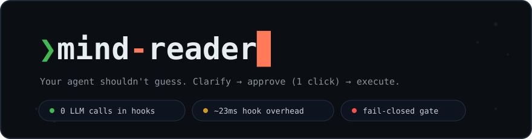
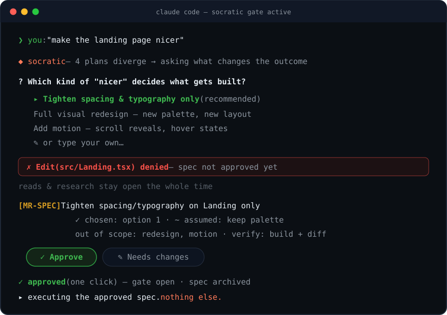
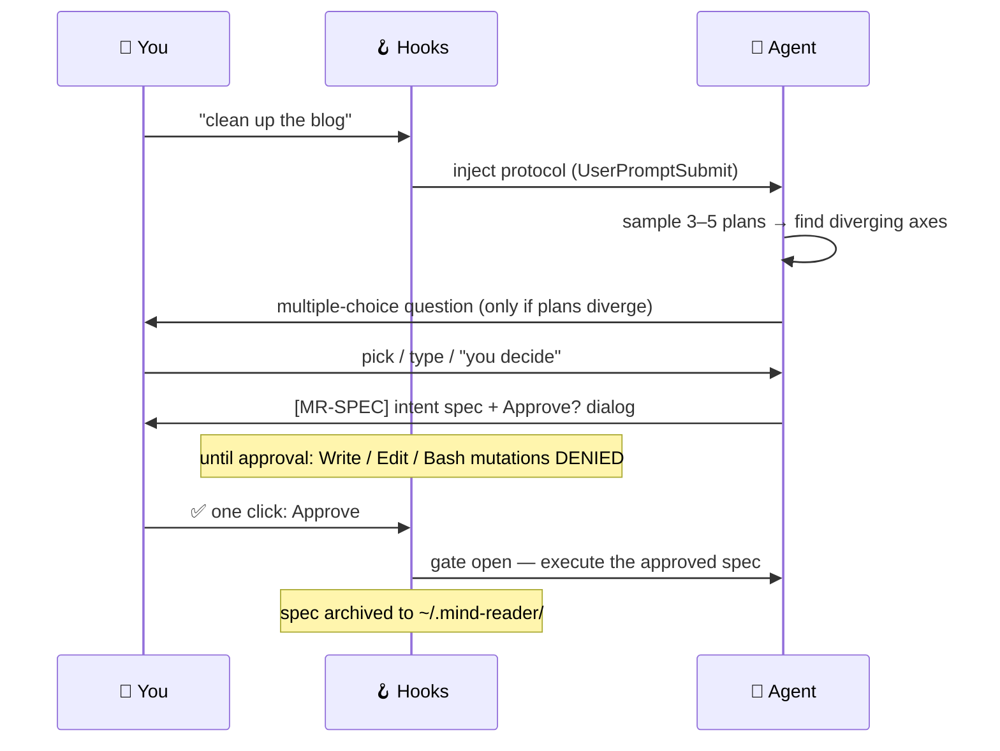

<div align="center">



<br/><br/>

[](LICENSE)
[](package.json)
[](https://claude.com/claude-code)
[](test)
[](#status--roadmap)

**A hook-based hard gate for CLI coding agents.** It intercepts every prompt, pins down your
*actual* intent through multiple-choice questions, and **technically blocks all writes and
command execution** until you approve a one-screen intent spec — with a single click.

*Named for the Socratic method: truth is drawn out by questioning — never assumed.*

</div>

---

## What it feels like

<div align="center">

</div>

Obvious requests skip the questions entirely — zero divergence means zero questions, just one
restated-intent dialog and a click. The interrogation only exists where interpretations
genuinely fork.

## Why

CLI agents are eager. Give them an ambiguous request and they'll pick *an* interpretation —
confidently, silently — and run with it. You find out three files later.

|   | Without | With socratic |
|---|---|---|
| Ambiguous request | 🎲 The model picks an interpretation and runs | 🎯 Plans are sampled; where they fork, you choose |
| "Ask before acting" | 🙏 A prompt the model may ignore | 🔒 A `PreToolUse` hook that *cannot* be ignored |
| Approval | 💬 Buried in chat scrollback | ✅ One click on a spec you can actually see |
| Your intent | 🌫️ Evaporates after the session | 📚 Archived as `[MR-SPEC]` files, project by project |
| Multi-turn drift | 📉 [~39% quality drop](https://arxiv.org/abs/2505.06120) from scattered context | 📄 The refined spec becomes a single-turn contract |

Prompting the model to "ask clarifying questions" doesn't fix this, because it leaves the
decision to model discretion: sometimes it asks, sometimes it doesn't. **socratic** removes
the discretion.

> **The model doesn't remember the process. The process enforces itself.**

## How it works

Three hooks, one shared state machine, no LLM calls inside the hooks (millisecond overhead):



| Hook | Role | Failure semantics |
|---|---|---|
| `UserPromptSubmit` | Lightweight filter (greetings, questions, and slash commands pass through), then protocol injection | fail-open (soft layer) |
| `PreToolUse` | Default-deny write gate until approval. Read tools always allowed; Bash restricted to a structural read-only allowlist (no chaining, substitution, or redirection) | **fail-closed** (hard layer) |
| `Stop` | Gates non-file work too (writing, research): the agent can't end its turn mid-cycle without either asking or presenting a spec | fail-open, max 3 re-blocks |

### Details that took real debugging to get right

- 🖱️ **Obvious requests cost one click, not an interrogation.** Zero divergence → no questions →
  a single dialog restating the request as a spec.
- 🔗 **Approval binds to what you saw.** The gate reads your actual dialog selection from the
  transcript, refuses labels that merely *contain* "approve", rejects negated free-text
  ("approve, but…"), and won't accept approvals from a previous cycle or a subagent's transcript.
- 🧨 **Irreversible actions always get confirmed** — deletes, deploys, force-pushes — even when
  you said "just handle it".
- 🚫 **No self-approval.** State lives outside the project (`~/.mind-reader/`), and the
  pre-approval Bash allowlist can't write to it. Subagents inherit the gate (verified empirically).
- 📚 **Specs accumulate.** Every approved spec is archived with metadata — a searchable record of
  what you actually decided.

## Install

Requires [Claude Code](https://claude.com/claude-code) and Node ≥ 18.

```bash
git clone https://github.com/w0uldy0udaestar/socratic.git
cd socratic && ./install.sh
```

The installer builds, then **merges** hooks into `~/.claude/settings.json` — it backs up first,
appends only marker-identified entries, never touches your existing hooks, and runs a self-test.
Remove cleanly with `./uninstall.sh`.

## Turning it off

The gate only operates mid-cycle — when idle or after approval it blocks nothing. When you do
need out:

| Scope | How |
|---|---|
| 📁 One project | create an empty `.mind-reader-off` file in the project root |
| 🌍 Everywhere, instantly | `MIND_READER_OFF=1` |
| 🗑️ Completely | `./uninstall.sh` |

## Telemetry

socratic instruments itself so you can tell whether it's earning its keep:

```bash
npm run stats           # all projects
npm run stats -- <dir>  # one project
```

Reported: question rate, average questions per cycle, **spec revision rate** (near 0% means the
confirmation step has become a rubber stamp), abandonment rate, gate-denial breakdown, and
whether approvals come from the dialog or typed text.

## Design principles

| Principle | Why |
|---|---|
| Always-on, hook-enforced | Skills and instruction files are model-discretionary; hooks are deterministic. |
| Two-tier enforcement | Injection (soft) shapes behavior; the write gate (hard) makes "guess and run" impossible. |
| Convergence is the only exit | No question cap. Fatigue is managed by question *value density* — every question must actually change the plan — not by an arbitrary limit. [Users happily answer questions that improve results.](https://arxiv.org/abs/2407.12017) |
| Questions supply vocabulary | Recognition beats recall. If you can't articulate it, the agent switches angles: options → strawman proposal you correct → tiny mockup you react to. |
| The spec is the product | Half the value is your own thinking, made explicit and archived. |
| Fail-safe by layer | The hard gate fails closed; soft layers fail open; a hook that can't even start leaves your agent usable. |

## Status & roadmap

**v0.1 — Claude Code.** Core complete: 200+ assertions across unit, robustness, gate-matrix,
telemetry, and headless E2E suites, plus an adversarial code review of the approval channel.
Currently being dogfooded by its author; friction findings feed the design directly (the
one-click approval channel exists because typing "approve" turned out to be exactly the kind of
friction that gets a tool uninstalled).

| Version | Target | Status |
|---|---|---|
| **v0.1** | Claude Code (`UserPromptSubmit` + `PreToolUse` + `Stop`) | ✅ core complete, dogfooding |
| v0.2 | Gemini CLI (`BeforeAgent` / `BeforeTool` / `ask_user`) | 🔜 |
| v0.3 | OpenAI Codex CLI | ⏳ |
| v0.4 | opencode / Amp | ⏳ |

Design history, decision log (D1–D16), and research notes live in [`PLAN.md`](PLAN.md) and
[`docs/`](docs/) — currently in Korean; the decision IDs referenced in code comments resolve there.

## Development

```bash
npm install
npm run build   # tsc → dist/
npm test        # unit · telemetry · install · robustness · gate-matrix
```

Tests isolate `$HOME`, so running them never pollutes your real usage metrics.

---

<div align="center">

**If your agent guessed wrong today, that was the last time it had to.**

⭐ Star the repo if you'd rather approve intent than review damage.

[MIT](LICENSE) · built by dogfooding · PRs welcome

</div>
